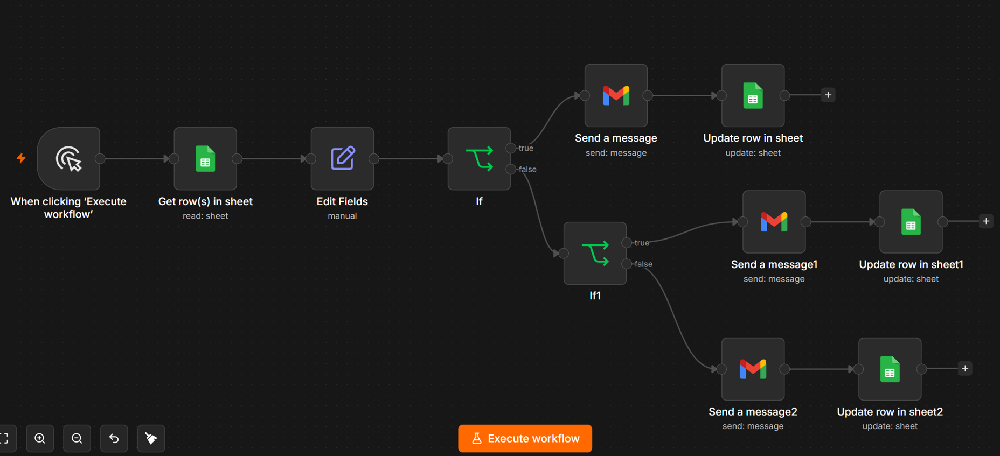
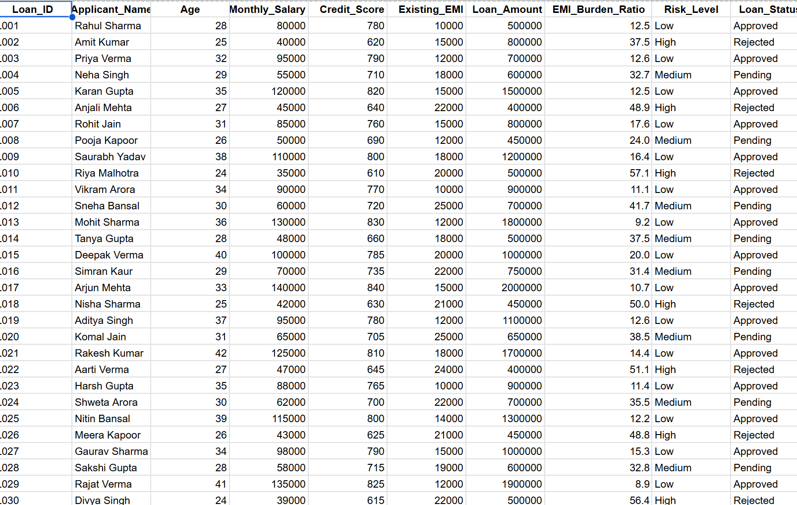
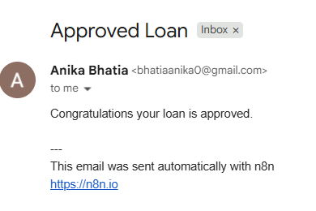
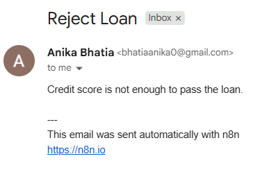

# 🏦 Loan Approval Automation

## 📌 Project Overview

Loan Approval Automation is an automated workflow built using **n8n** and **Google Sheets** to streamline the loan approval process. The system automatically evaluates loan applications based on predefined criteria and generates approval, rejection, or spending alerts without manual intervention.

This project helps financial institutions improve efficiency, reduce processing time, and ensure consistent decision-making.

---

## 🚀 Features

- Automated loan application processing
- Google Sheets integration for data management
- Loan approval and rejection workflow
- Real-time notifications and alerts
- Spending risk monitoring
- Reduced manual effort and errors
- Easy-to-customize business rules

---

## 🛠️ Technologies Used

- **n8n** – Workflow Automation
- **Google Sheets** – Data Storage and Tracking
- **Email/Notifications** – Alert Generation
- **Business Rules Logic** – Decision Making

---

## 🔄 Workflow Process

### Step 1: Loan Application Entry
Applicant information is entered into Google Sheets.

### Step 2: Data Retrieval
n8n automatically reads new application records.

### Step 3: Eligibility Evaluation
The workflow checks:
- Applicant Income
- Credit Score
- Existing Liabilities
- Requested Loan Amount

### Step 4: Decision Making

Based on predefined conditions:

- ✅ Loan Approved
- ❌ Loan Rejected
- ⚠️ Spending Alert Generated

### Step 5: Notification Delivery

Automated notifications are sent to relevant stakeholders.

---

## 📸 Project Screenshots

### n8n Workflow

### Google Sheets Integration

### Loan Approval Alert

### Loan Rejection Alert

### Spending Alert

---

## 🎯 Benefits

- Faster loan processing
- Improved operational efficiency
- Consistent approval decisions
- Better risk monitoring
- Reduced manual errors
- Enhanced customer experience

---

## 🔮 Future Enhancements

- AI-based credit scoring
- Fraud detection system
- Banking API integration
- Real-time dashboard
- SMS and WhatsApp notifications
- Machine Learning-based approval predictions

---

## 👨‍💻 Author

**dh.sharma8220000-design**

Developed as an automation project demonstrating workflow automation, financial process optimization, and decision-making using n8n.

---

## 📄 License

This project is intended for educational, learning, and demonstration purposes.
